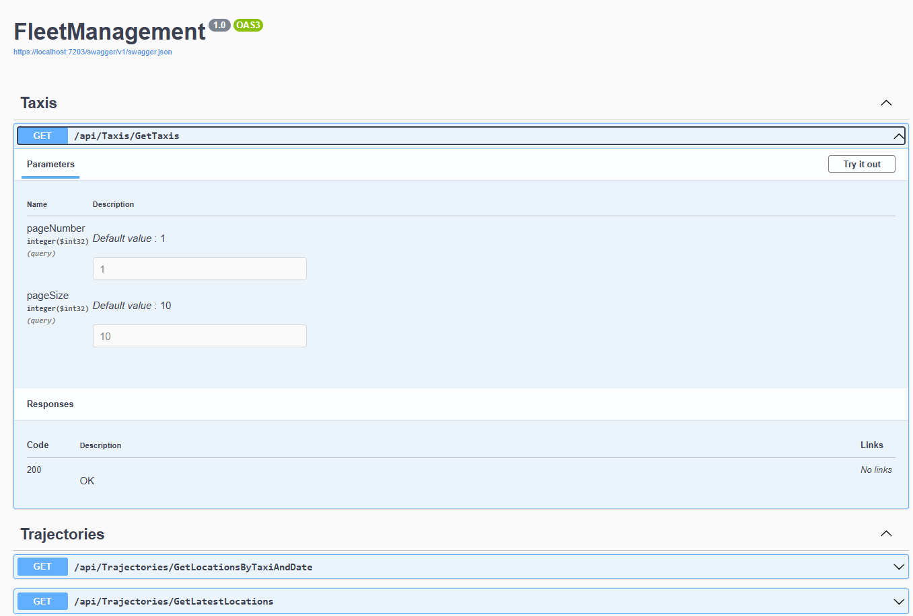
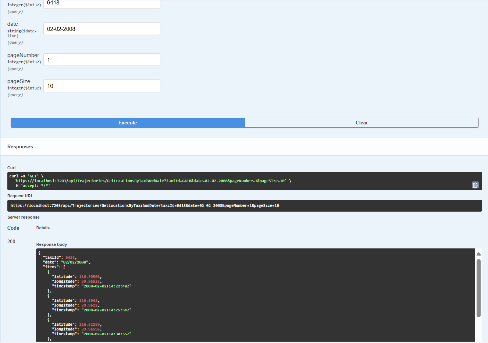
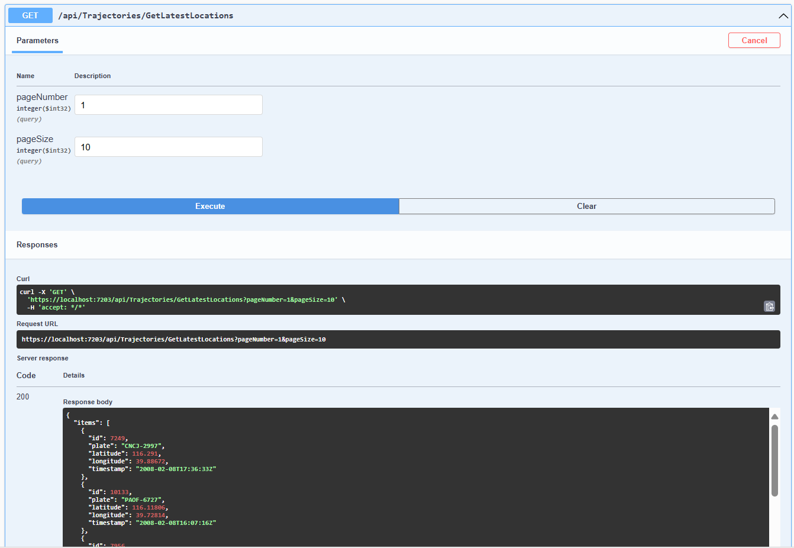

# FLEET MANAGEMENT

## Índice

* [1. Resumen del proyecto](#2-resumen-del-proyecto)
* [2. Herramientas](#3-herramientas)
* [3. Historias de usuario](#4-historias-de-usuario)
* [4. Prototipos](#5-prototipos)
* [5. Planificación del proyecto](#6-planificacion-del-proyecto)
* [6. Resultado](#7-resultado)

## 1. Resumen del proyecto

En este proyecto se contruyó la API REST de un Fleet Management Software para consultar las ubicaciones de los vehículos de una empresa de taxis en Beijing, China.

Con las ubicaciones de casi 10 mil taxis. Se aplicaron técnicas para almacenar y consultar esta información, usando PostgreSQL.

Se decoumento los endpoints de la API en Swagger.

## 3. Herramientas
### Uso de lenguaje C#
Se creó un proyecto Web API en C# con la plantilla "API con controladores", también se usó Entity Framework, un ORM que simplifica el acceso y manipulación de bases de datos.  

### Modelamiento de datos
Se usó vercel Postgresql, se creó tablas en la base de datos para almacenar la información entregada. Te recomendamos entonces crear dos tablas, una para almacenar la información de taxis y otra para almacenar la información de ubicaciones. Deberás definir las columnas de cada tabla de acuerdo a la información entregada.

### Definir endpoints de API
Se definió y documento los endpoints de la APIen Swagger.

Para una API REST debes definir para cada endpoint entre otras cosas el método HTTP, url, parámetros, encabezados, códigos HTTP de respuesta y cuerpo.
## 4. Historias de Usuario

#### [Historia de usuario 1] Cargar información a base de datos

Yo, como desarrolladora, quiero cargar la información almacenada hasta ahora en
[archivos sql](https://drive.google.com/file/d/1T5m6Vzl9hbD75E9fGnjbOiG2UYINSmLx/view?usp=drive_link)
en una base de datos PostgreSQL, para facilitar su consulta y análisis.

##### Criterios de aceptación

* Se debe tener en cuenta el siguiente diagrama para la implementación de las
relaciones entre las tablas

* La tabla de _trajectories_ se debe crear con el "id" que se incremente
automáticamente (SERIAL) para poder insertar los valores sin necesidad
de especificar un identificador

##### Definición de terminado

* La base de datos tiene creada la tabla de taxis
* La tabla de taxis tiene cargada la data de taxis
* La base de datos tiene creada la tabla de trayectorias
* La tabla de taxis tiene cargada la data de trayectorias

***

##### [Historia de usuario 2] Endpoint listado de taxis

Yo como clienta de la API REST requiero un _endpoint_ para
listar todos los taxis.

##### Criterios de aceptación

* El _endpoint_ responde para cada taxi: id y placa.
* El _endpoint_ paginamos los resultados para asegurar que las
respuestas sean más fáciles de manejar.

##### Definición de terminado

* Se cuenta con una documentación en [Swagger](https://swagger.io/)
para el _endpoint_ desarrollado especificando
[método HTTP](https://developer.mozilla.org/en-US/docs/Web/HTTP/Methods),
url, parámetros,
[encabezados](https://developer.mozilla.org/en-US/docs/Web/HTTP/Headers),
[códigos HTTP de respuesta](https://shorturl.at/bdegB)
y
[cuerpo](https://developer.mozilla.org/en-US/docs/Web/HTTP/Messages).
* El código del _endpoint_ debe recibir _code review_ de al
menos una compañera.
* El código _endpoint_ debe estar cargado en un repositorio de Github.
* El código _endpoint_ debe contar con test unitarios y e2e.

***

#### [Historia de usuario 3] Endpoint historial de ubicaciones

Yo como clienta de la API REST requiero un _endpoint_ para
consultar todas las ubicaciones de un taxi dado el id y una fecha.

##### Criterios de aceptación

* El _endpoint_ responde con el id del taxi y una fecha mostrando
  la siguiente información: latitud, longitud y timestamp (fecha y hora).
* El _endpoint_ paginamos los resultados para asegurar que las
  respuestas sean más fáciles de manejar.

##### Definición de terminado

* Se cuenta con una documentación en [Swagger](https://swagger.io/)
para el _endpoint_ desarrollado especificando
[método HTTP](https://developer.mozilla.org/en-US/docs/Web/HTTP/Methods),
url, parámetros,
[encabezados](https://developer.mozilla.org/en-US/docs/Web/HTTP/Headers),
[códigos HTTP de respuesta](https://shorturl.at/bdegB)
y
[cuerpo](https://developer.mozilla.org/en-US/docs/Web/HTTP/Messages).
* El código del _endpoint_ debe recibir _code review_ de al
menos una compañera.
* El código _endpoint_ debe estar cargado en un repositorio de Github.
* El código _endpoint_ debe contar con test unitarios y e2e.

***

#### [Historia de usuario 4] Endpoint última ubicación

Yo como clienta de la API REST requiero un _endpoint_ para
consultar la última ubicación reportada por cada taxi.

##### Criterios de aceptación

* El _endpoint_ responde para cada taxi la siguiente información:
id, placa, latitud, longitud y timestamp (fecha y hora).
* El _endpoint_ paginamos los resultados para asegurar que las
respuestas sean más fáciles de manejar.

##### Definición de terminado

* Se cuenta con una documentación en [Swagger](https://swagger.io/)
para el _endpoint_ desarrollado especificando
[método HTTP](https://developer.mozilla.org/en-US/docs/Web/HTTP/Methods),
url, parámetros,
[encabezados](https://developer.mozilla.org/en-US/docs/Web/HTTP/Headers),
[códigos HTTP de respuesta](https://shorturl.at/bdegB)
y
[cuerpo](https://developer.mozilla.org/en-US/docs/Web/HTTP/Messages).
* El código del _endpoint_ debe recibir _code review_ de al
menos una compañera.
* El código _endpoint_ debe estar cargado en un repositorio de Github.
* El código _endpoint_ debe contar con test unitarios y e2e.

***

### Testing

El proyecto cuenta con tests para cada controlador Taxis y Trajectories

## 6. Planificación del proyecto

Me planifiqué en Git Hub projects, este me ayudo a optimizar mi proceso y hacerle seguimiento a mi avance diario.

## 7. Resultado

